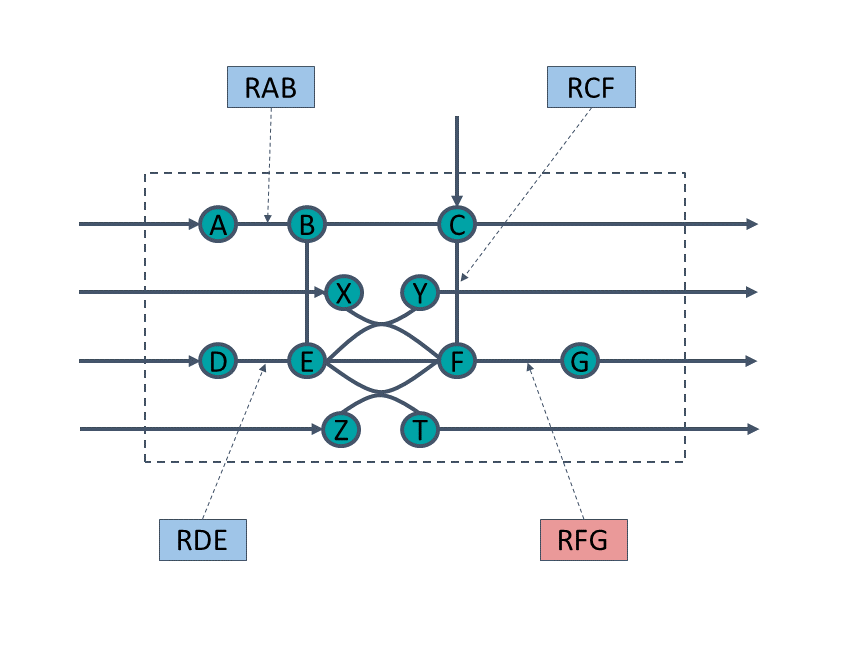

# Toy models

**small4M** and **small4S** are two toy models that can be used to get a grasp of how the different algorithms work.  
The `dexom_python/toy_models.py` module contains the code for producing these models, as well as the code for producing a dagNet model where the metabolites of successive layers are all interconnected.

Below is a diagram of the small4M model, together with the reaction weights provided for the example.  
With the given weights, the model has four equally optimal flux distributions (one of which is the absence of flux in all reactions)

And below is a diagram of the small4S model, together with the reaction weights provided for the example.  
With the given weights, the model has four equally optimal flux distributions (one of which is the presence of flux in all reactions)

